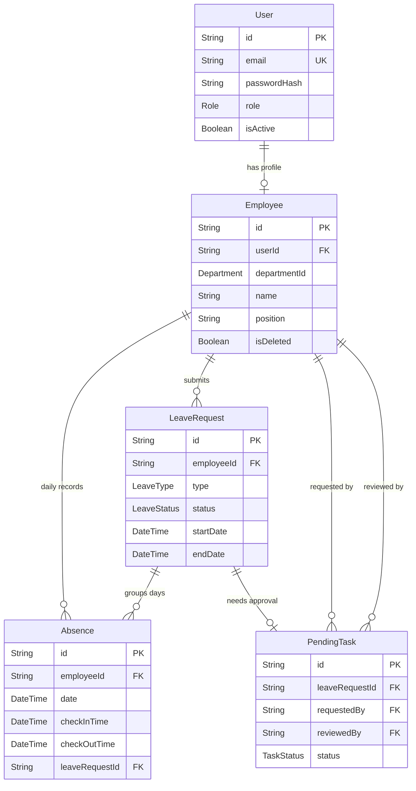

# Dexa Absence Service

Employee absence management API built with Next.js, PostgreSQL, and RabbitMQ.

---

## Table of Contents

- [Requirements](#requirements)
- [First Time Setup](#first-time-setup)
- [Test Accounts](#test-accounts)
- [Common Commands](#common-commands)
- [ERD](#erd)
- [Smoke Test](#smoke-test)

---

## Requirements

Before you start, make sure these are installed on your machine:

- [Node.js 20+](https://nodejs.org)
- [PostgreSQL 14+](https://www.postgresql.org/download/) — running on port `5432`
- [RabbitMQ 3.12+](https://www.rabbitmq.com/download.html) — running on port `5672`

> You can use `docker compose up -d` to start PostgreSQL and RabbitMQ locally instead of installing them manually.

---

## First Time Setup

### 1. Install dependencies

```bash
npm install
```

### 2. Set up environment variables

```bash
cp .env.example .env
```

Open `.env` and update `JWT_SECRET` with a random string:

```bash
openssl rand -base64 32
```

Leave everything else as default if you're running PostgreSQL and RabbitMQ locally with default credentials.

### 3. Create databases

This creates both `dexa_absence` and `dexa_logging` databases with the `dexa` user:

```bash
npm run db:setup
```

> Assumes PostgreSQL superuser is `postgres` / `postgres`. If yours is different, edit `scripts/setup-db.ts`.

### 4. Run migrations

```bash
npm run db:migrate
npm run db:migrate:logging
```

### 5. Generate Prisma clients

```bash
npm run db:generate
npm run db:generate:logging
```

### 6. Seed initial data

```bash
# M2M service account (required for internal API calls)
npm run db:init:m2m

# HR employees
npm run db:init:hr

# Regular employees with absences and leave requests
npm run db:init:employee
```

### 7. Start the server

```bash
npm run dev
```

Server runs at `http://localhost:3000`
API docs at `http://localhost:3000/api-docs`

---

## Test Accounts

After seeding, you can log in with these accounts:

| Email | Password | Role |
|---|---|---|
| `api.gateway@dexa.com` | `api.gateway` | HR (M2M) |
| `hendra.gunawan@dexa.com` | `password` | HR |
| `maya.putri@dexa.com` | `password` | HR |
| `raka.pratama@dexa.com` | `password` | Employee |
| `layla.nur@dexa.com` | `password` | Employee |
| `dimas.arya@dexa.com` | `password` | Employee |
| `sari.indah@dexa.com` | `password` | Employee |

---

## Common Commands

| Command | Description |
|---|---|
| `npm run dev` | Start development server |
| `npm run build` | Build for production |
| `npm start` | Start production server |
| `npm run lint` | Check for code issues |
| `npm run lint:fix` | Auto-fix code issues |
| `npm run db:setup` | Create databases and user |
| `npm run db:drop` | Drop all databases and user |
| `npm run db:studio` | Open Prisma Studio (main DB) |
| `npm run db:studio:logging` | Open Prisma Studio (logging DB) |

---

## ERD

The full ERD is at `docs/design/ERD.md` in Mermaid format.

**To view it in VS Code:**
1. Install the [Markdown Preview Mermaid Support](https://marketplace.visualstudio.com/items?itemName=bierner.markdown-mermaid) extension
2. Open `docs/design/ERD.md`
3. Press `Cmd+Shift+V` (Mac) or `Ctrl+Shift+V` (Windows) to open the preview

**To view it in JetBrains (IntelliJ / WebStorm):**
1. Install the [Mermaid](https://plugins.jetbrains.com/plugin/20146-mermaid) plugin via `Settings → Plugins`
2. Open `docs/design/ERD.md`
3. Click the preview panel on the right

**Preview:**



---

## Smoke Test

The Postman collection is at `docs/smoke-test/Dexa Absence Service - Smoke Test Case.json`.

### Steps

**1. Import the collection**

Open Postman → click **Import** → select the file:
```
docs/smoke-test/Dexa Absence Service - Smoke Test Case.json
```


**2. Overview**


**3. Set up variables**

Go to the collection → **Variables** tab → set `baseUrl` to your server:
```
http://localhost:3000
```


**4. Run the smoke test**

Click **Run collection** → hit **Run Dexa Absence Service**


**5. Check results**

All requests should return green. Failed requests show the response diff.


**6. Enable response validation**

To validate response schema, enable **Response validation** in the collection settings.


