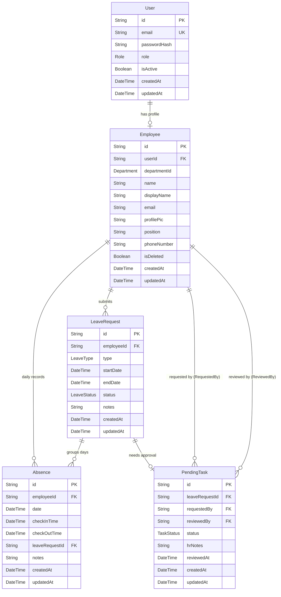

```mermaid
erDiagram
    User {
        String id PK
        String email UK
        String passwordHash
        Role role
        Boolean isActive
        DateTime createdAt
        DateTime updatedAt
    }

    Employee {
        String id PK
        String userId FK
        Department departmentId
        String name
        String displayName
        String email
        String profilePic
        String position
        String phoneNumber
        Boolean isDeleted
        DateTime createdAt
        DateTime updatedAt
    }

    Absence {
        String id PK
        String employeeId FK
        DateTime date
        DateTime checkInTime
        DateTime checkOutTime
        String leaveRequestId FK
        String notes
        DateTime createdAt
        DateTime updatedAt
    }

    LeaveRequest {
        String id PK
        String employeeId FK
        LeaveType type
        DateTime startDate
        DateTime endDate
        LeaveStatus status
        String notes
        DateTime createdAt
        DateTime updatedAt
    }

    PendingTask {
        String id PK
        String leaveRequestId FK
        String requestedBy FK
        String reviewedBy FK
        TaskStatus status
        String hrNotes
        DateTime reviewedAt
        DateTime createdAt
        DateTime updatedAt
    }

    User ||--o| Employee : "has profile"
    Employee ||--o{ Absence : "daily records"
    Employee ||--o{ LeaveRequest : "submits"
    LeaveRequest ||--o{ Absence : "groups days"
    LeaveRequest ||--o| PendingTask : "needs approval"
    Employee ||--o{ PendingTask : "requested by (RequestedBy)"
    Employee ||--o{ PendingTask : "reviewed by (ReviewedBy)"
```
